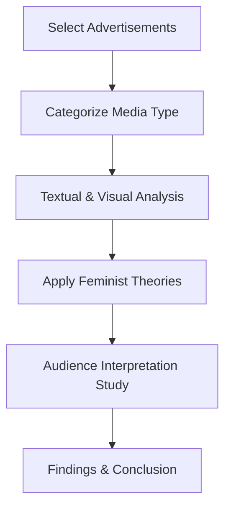

# Women, Beauty, and Patriarchy

### A Feminist Reading of Fairness Cream Advertisements

 
 


---

## 📌 Project Overview

This research project critically examines how fairness cream advertisements construct and reinforce ideals of female beauty within a patriarchal media framework. It investigates how skin tone, attractiveness, and success are represented in advertising and how these representations influence social perception, particularly in South Asian contexts.

Using feminist media studies, the research explores how advertisements normalize fair skin as an ideal standard of beauty and how audiences interpret, negotiate, or resist these messages.

---

## 📁 Repository Structure

```
Research-Paper/
│
├── README.md
├── paper/
│   └── final_research_paper.pdf
│
├── ads/
│   ├── tv/
│   ├── youtube/
│   ├── print/
│
├── analysis/
│   ├── textual_analysis.md
│   ├── visual_analysis.md
│
├── data/
│   └── advertisement_list.csv
│
└── notebook/
    └── feminist_ad_analysis.ipynb
```

---

## 🎯 Research Objectives

* To examine how fairness cream advertisements construct ideals of female beauty through skin tone, appearance, and attractiveness.
* To analyze the patriarchal values and gender stereotypes embedded in these advertisements.
* To explore how women viewers interpret and respond to beauty messages promoted in fairness cream advertisements.

---

## ❓ Research Questions

* How do fairness cream advertisements represent women, beauty, and desirability?
* In what ways do these advertisements reproduce patriarchal norms and gender expectations?
* How do women audiences perceive, negotiate, or resist these messages?

---

## 🧠 Theoretical Framework

* Feminist Theory (Gender & Power)
* Laura Mulvey – Male Gaze Theory
* Naomi Wolf – Beauty Myth
* Postcolonial Feminism – Skin Colour Politics

---

## 🧪 Methodology

### Research Design

Qualitative interpretive study using feminist media analysis.

### Data Set

* 10–15 fairness cream advertisements from:

  * Television
  * YouTube
  * Print media
  * Digital campaigns

### Analysis Focus

* Narrative structure
* Before/after transformation
* Skin tone symbolism
* Body language
* Career/marriage success framing
* Voiceover and persuasive messaging

---

## 🔄 Research Workflow



---

## 📊 Scope of Study

This study explores how beauty is constructed through advertising and how these representations influence cultural understanding of women, identity, and success. It also considers audience reception and resistance.

---

## 💡 Why This Research?

This topic was chosen because beauty standards continue to strongly influence how women perceive themselves in today’s digital and advertising-driven world. Even with growing awareness of body positivity, fairness-based beauty ideals remain highly visible, especially in South Asia.

As a media student, this research helps critically analyze everyday advertisements that often go unquestioned. It also connects media theory with real-life experience by exploring how audiences understand, accept, or challenge these messages.

---

## 📚 Expected Outcome

The study is expected to show that fairness cream advertisements not only reflect social beliefs but also reinforce gender inequality and colorism. It also highlights audience agency in interpreting or resisting these media messages.

---

## 📓 Optional Notebook

A Jupyter Notebook (`feminist_ad_analysis.ipynb`) can be used for:

* Coding advertisement analysis
* Organizing visual/textual observations
* Thematic categorization

---

## 🏷️ Keywords

Feminism, Fairness Cream Ads, Beauty Ideology, Patriarchy, Colorism, Male Gaze, Media Representation, Audience Reception, Gender Stereotypes, Visual Culture

---

## 👥 Contributors

[](https://github.com/Mohima-Kmkr/Research-Paper/graphs/contributors)

This project is developed as part of academic research in Mass Communication and Journalism.

---

## 📊 Contributor Stats

### 👤 Mohima Karmakar


### 👤 Sagar Mishra


---

## 👩‍🎓 Author - Braja Mohima Karmakar

---

## 📌 Note

This project is a qualitative feminist media study analyzing visual culture and advertising narratives in contemporary society.

